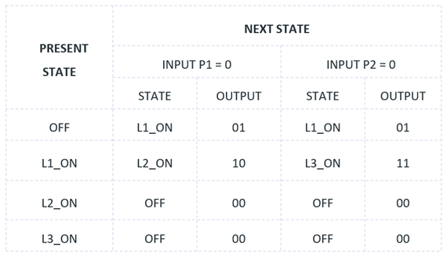
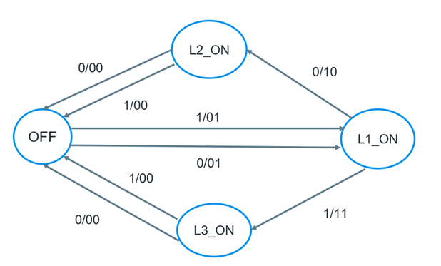

# Finite State Machine Simulator

A finite state machine simulator built using Javascript

## Problem Statement

The problem statement is originally from [here](https://flaviocopes.com/finite-state-machines/#:~:text=Our%20real%20world%20scenario%20is,the%20l1%20light%20turns%20on.)

-   Our real world scenario is this: we have a house, with one door, 2 buttons and 3 lights.
-   At the default state the lights are all turned off.
-   When you enter the house, you can press one of the 2 push buttons you have, p1 or p2. When you press any of those buttons, the l1 light turns on.
-   Imagine this is the entrance light, and you can take your jacket off. Once you are done, you decide which room you want to go into (kitchen or bedroom, for example).
-   If you press the button p1, l1 turns off and l2 turns on. Instead if you press the button p2, l1 turns off and l3 turns on.
-   Pressing another time any of the 2 buttons, p1 or p2, the light that is currently on will turn off, and we’ll get back at the initial state of the system.

## Solution

Check out the live demo [here](https://fsm-simulator-app.netlify.app/)
-   The output is dependent on the current state and the present input, thus, the given FSM is a **MEALY MACHINE**
-   The states are: OFF, L1_ON, L2_ON, L3_ON (00,01,10,11)
-   The inputs are: P1, P2 (0, 1 )

## Transition Table

## Transition diagram

**This mealy machine is simulated in this project using JavaScript**
